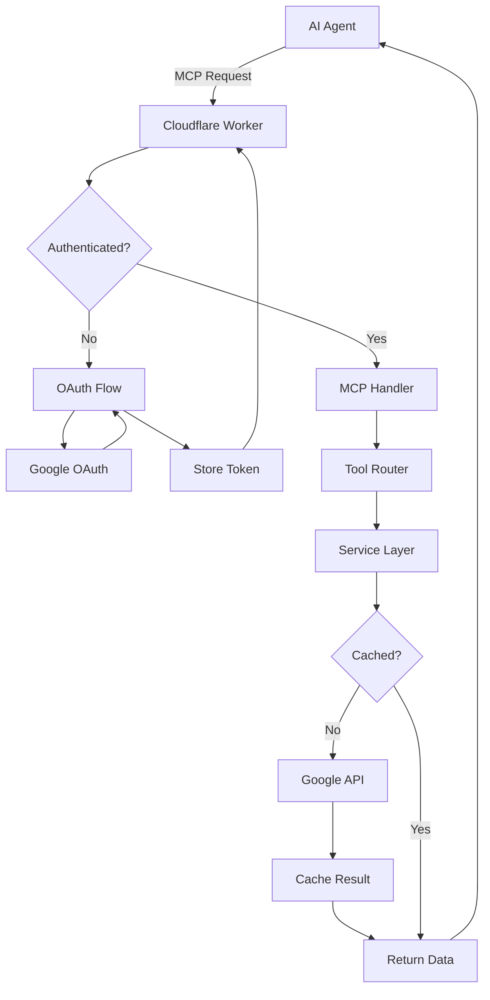

# Google Services MCP Server

## Table of Contents

1. [What is This?](#what-is-this)
2. [Why is it Useful?](#why-is-it-useful)
3. [Adding to Your AI Agent](#adding-to-your-ai-agent)
4. [Available Tools](#available-tools)
5. [Local Development Setup](#local-development-setup)
6. [Code Style Guidelines](#code-style-guidelines)
7. [Architecture Overview](#architecture-overview)
8. [Best Practices for AI Agents](#best-practices-for-ai-agents)

## What is This?

The **Google Services MCP Server** is a Model Context Protocol (MCP) server that acts as a bridge between AI assistants and Google's productivity tools. It's built on Cloudflare Workers and provides secure, read-only access to:

- **Google Drive**: Search and read meeting transcripts stored as Google Docs
- **Google Calendar**: Access meeting schedules, attendees, and event details

Think of it as giving your AI assistant the ability to "see" and understand your meeting history and upcoming schedule, enabling it to provide intelligent insights, summaries, and analysis.

### Key Concepts for Beginners

- **MCP (Model Context Protocol)**: A standard way for AI assistants to interact with external tools and data sources
- **Cloudflare Workers**: Serverless platform that runs your code at the edge, close to users
- **OAuth 2.0**: Secure authentication method that lets users grant limited access to their Google data
- **Read-Only Access**: The server can only read data, never modify or delete anything

## Why is it Useful?

### For AI Assistants

- **Meeting Intelligence**: Search through past meeting transcripts to find decisions, action items, or discussions
- **Schedule Awareness**: Know about upcoming meetings, attendees, and conflicts
- **Context Building**: Understand team dynamics and project history through meeting data
- **Time Saving**: Instantly access information without manual searching

### Real-World Use Cases

1. "What did we decide about the pricing strategy in last week's meeting?"
2. "Who attended the quarterly review and what were the main topics?"
3. "Find all meetings where we discussed the new feature launch"
4. "What meetings do I have tomorrow and who's attending?"
5. "Summarize all product roadmap discussions from the past month"

## Adding to Your AI Agent

For any MCP-compatible platform, you'll need:

- **Server URL**: `https://google-services-mcp.efp.workers.dev/sse`
- **Authentication**: Handled automatically through browser-based OAuth flow

### Claude desktop

You will have to add the MCP server as a "Connector". Under the "Custom Connectors" section, you will click the "Add custom connector" and enter "https://google-services-mcp.efp.workers.dev/sse"

## Available Tools

### 🗂️ Google Drive Tools

#### 1. `search_meeting_transcripts`

Search through all meeting documents for specific content.

**Parameters:**

- `query` (string, required): What to search for
- `folderId` (string, optional): Limit search to specific folder

**Example Usage:**

```json
{
  "tool": "search_meeting_transcripts",
  "arguments": {
    "query": "Q4 revenue targets",
    "folderId": "1A0n63cvNloB_h7c6SQpP0R8kzmZMOL9D"
  }
}
```

**Returns:** List of matching documents with snippets showing where your query appears

#### 2. `get_meeting_transcript`

Retrieve the complete content of a meeting transcript.

**Parameters:**

- `fileId` (string, required): The Google Drive file ID

**Example Usage:**

```json
{
  "tool": "get_meeting_transcript",
  "arguments": {
    "fileId": "1BxiMVs0XRA5nFMdKvBdBZjgmUUqptlbs74OgvE2upms"
  }
}
```

**Returns:** Full document content as text

#### 3. `list_recent_meetings`

Get the most recently modified meeting documents.

**Parameters:**

- `folderId` (string, optional): Folder to list from
- `limit` (number, optional, default: 10): How many to return

**Example Usage:**

```json
{
  "tool": "list_recent_meetings",
  "arguments": {
    "limit": 20
  }
}
```

**Returns:** List of recent documents with metadata (title, last modified, file ID)

### 📅 Google Calendar Tools

#### 4. `get_upcoming_meetings`

View scheduled meetings with details.

**Parameters:**

- `daysAhead` (number, optional, default: 7): How many days to look ahead
- `calendarId` (string, optional): Which calendar to check

**Example Usage:**

```json
{
  "tool": "get_upcoming_meetings",
  "arguments": {
    "daysAhead": 14
  }
}
```

**Returns:** List of meetings with title, time, location, and attendee count

#### 5. `get_meeting_attendees`

Get detailed attendee information for a specific meeting.

**Parameters:**

- `eventId` (string, required): The calendar event ID
- `calendarId` (string, optional): Which calendar

**Example Usage:**

```json
{
  "tool": "get_meeting_attendees",
  "arguments": {
    "eventId": "5pp2o3jm6gr3jghb6or3jghb6o"
  }
}
```

**Returns:** List of attendees with names, emails, and response status

#### 6. `search_meetings_by_date`

Find meetings within a date range.

**Parameters:**

- `startDate` (string, required): Start date (YYYY-MM-DD)
- `endDate` (string, required): End date (YYYY-MM-DD)
- `calendarId` (string, optional): Which calendar

**Example Usage:**

```json
{
  "tool": "search_meetings_by_date",
  "arguments": {
    "startDate": "2024-01-15",
    "endDate": "2024-01-31"
  }
}
```

**Returns:** All meetings within the date range

## Local Development Setup

### Prerequisites

- **Node.js 20+**: Download from [nodejs.org](https://nodejs.org/)
- **npm**: Comes with Node.js
- **Cloudflare Account**: Free at [cloudflare.com](https://cloudflare.com)
- **Google Cloud Project**: With Drive and Calendar APIs enabled

### Step-by-Step Setup

1. **Clone the repository:**

   ```bash
   git clone https://github.com/your-username/google-service-mcp.git
   cd google-service-mcp
   ```

2. **Install dependencies:**

   ```bash
   npm install
   ```

3. **Create `.dev.vars` file:**

   ```bash
   cp .dev.vars.example .dev.vars
   ```

4. **Configure Google OAuth:**
   - Go to [Google Cloud Console](https://console.cloud.google.com)
   - Create OAuth 2.0 credentials
   - Add `http://localhost:8787/callback` to redirect URIs
   - Copy client ID and secret to `.dev.vars`

5. **Update `.dev.vars`:**

   ```env
   GOOGLE_CLIENT_ID=your-client-id-here
   GOOGLE_CLIENT_SECRET=your-client-secret-here
   COOKIE_ENCRYPTION_KEY=generate-32-byte-base64-key
   GOOGLE_DRIVE_FOLDER_ID=your-shared-folder-id
   GOOGLE_CALENDAR_ID=primary
   ```

6. **Generate encryption key:**

   ```bash
   openssl rand -base64 32
   ```

7. **Create KV namespace:**

   ```bash
   npx wrangler kv:namespace create oauth_sessions
   npx wrangler kv:namespace create cache
   ```

8. **Start development server:**

   ```bash
   npm run dev
   ```

9. **Test the server:**
   - Open `http://localhost:8787` in your browser
   - You should see the MCP server running

### Troubleshooting Common Issues

- **"Cannot find module"**: Run `npm install` again
- **"Invalid client ID"**: Check your Google OAuth credentials
- **"KV namespace not found"**: Create the namespaces using wrangler
- **Port already in use**: Change the port in `wrangler.toml`

## Code Style Guidelines

### TypeScript Standards

1. **Strict Mode**: Always use TypeScript strict mode

   ```typescript
   // ✅ Good
   const result: string | null = await fetchData()
   if (result) {
     console.log(result.toUpperCase())
   }

   // ❌ Bad
   const result = await fetchData()
   console.log(result.toUpperCase()) // Could be null!
   ```

2. **Explicit Types**: Define types for all function parameters and returns

   ```typescript
   // ✅ Good
   async function searchFiles(query: string, limit: number = 10): Promise<FileResult[]> {
     // implementation
   }

   // ❌ Bad
   async function searchFiles(query, limit = 10) {
     // implementation
   }
   ```

3. **Interface Naming**: Use `I` prefix for interfaces
   ```typescript
   interface IFileMetadata {
     id: string
     name: string
     modifiedTime: string
   }
   ```

### Service Layer Pattern

All services follow this structure:

```typescript
export class ExampleService {
  private accessToken: string

  constructor(accessToken: string) {
    this.accessToken = accessToken
  }

  private async makeRequest<T>(url: string, options?: RequestInit): Promise<T> {
    const response = await fetch(url, {
      ...options,
      headers: {
        ...options?.headers,
        Authorization: `Bearer ${this.accessToken}`,
      },
    })

    if (!response.ok) {
      throw new Error(`API error: ${response.status} ${response.statusText}`)
    }

    return response.json()
  }

  async publicMethod(): Promise<SomeType> {
    try {
      return await this.makeRequest<SomeType>('/api/endpoint')
    } catch (error) {
      throw new Error(`Failed to fetch data: ${error.message}`)
    }
  }
}
```

### Error Handling

1. **Always use try-catch** in tool implementations
2. **Provide context** in error messages
3. **Never expose** sensitive data (tokens, user info)
4. **Return user-friendly** messages

```typescript
// ✅ Good
try {
  const result = await driveService.searchFiles(query)
  return { success: true, data: result }
} catch (error) {
  return {
    success: false,
    error: `Failed to search files: ${error.message}`,
  }
}

// ❌ Bad
const result = await driveService.searchFiles(query)
return result // No error handling!
```

### File Organization

```
src/
├── index.ts              # Main MCP server class
├── google-handler.ts     # OAuth routes
├── services/            # Business logic
│   ├── google-drive.service.ts
│   ├── google-calendar.service.ts
│   └── cache.service.ts
├── types/              # TypeScript definitions
│   └── env.d.ts
├── utils.ts            # Shared utilities
└── workers-oauth-utils.ts  # OAuth helpers
```

### Naming Conventions

- **Files**: kebab-case (`google-drive.service.ts`)
- **Classes**: PascalCase (`GoogleDriveService`)
- **Functions**: camelCase (`searchFiles`)
- **Constants**: UPPER_SNAKE_CASE (`DEFAULT_CACHE_TTL`)
- **Interfaces**: IPascalCase (`IFileMetadata`)

## Architecture Overview

### Technology Stack

- **Runtime**: Cloudflare Workers (V8 isolates)
- **Language**: TypeScript 5.x
- **Framework**: Hono (for OAuth routes)
- **Storage**: Workers KV (key-value store)
- **State**: Durable Objects (for MCP instances)
- **Auth**: OAuth 2.0 with Google

### Request Flow



### Key Components

1. **MCP Agent Class**: Main entry point, extends `McpAgent`
2. **OAuth Handler**: Hono app for authentication flow
3. **Service Layer**: Abstracts Google API interactions
4. **Cache Service**: Reduces API calls with intelligent caching
5. **Durable Objects**: Provides isolated, stateful execution

### Security Architecture

- **Read-Only Scopes**: Can never modify user data
- **Token Encryption**: Access tokens encrypted in storage
- **HMAC Signatures**: Client approval tracked securely
- **CORS Protection**: Prevents unauthorized access
- **Rate Limiting**: Built-in via Cloudflare

## Best Practices for AI Agents

### 1. Use Caching Wisely

The server implements caching to reduce API calls:

- File lists: 5 minutes
- File content: 1 hour
- Calendar events: 5 minutes

**Tip**: Don't repeatedly call the same tool within these windows.

### 2. Handle Errors Gracefully

Always check for errors in tool responses:

```javascript
const result = await callTool('search_meeting_transcripts', { query: 'budget' })

if (result.error) {
  // Handle the error appropriately
  console.log('Search failed:', result.error)
  // Maybe try a different query or inform the user
} else {
  // Process the successful result
  processSearchResults(result.data)
}
```

### 3. Optimize Your Queries

**For searching:**

- Use specific keywords rather than full sentences
- Combine related searches into one query when possible
- Use folder IDs to narrow search scope

**For calendar:**

- Request only the date range you need
- Cache event IDs for follow-up queries

### 4. Respect Rate Limits

Even with caching, be mindful of:

- Google API quotas (especially for Drive)
- Cloudflare Worker limits
- Network latency

### 5. Tool Selection Strategy

Choose the right tool for the task:

| Task                     | Best Tool                    | Why              |
| ------------------------ | ---------------------------- | ---------------- |
| Find specific discussion | `search_meeting_transcripts` | Full-text search |
| Get meeting details      | `get_meeting_transcript`     | Complete content |
| Recent activity overview | `list_recent_meetings`       | Quick summary    |
| Schedule planning        | `get_upcoming_meetings`      | Future events    |
| Attendee analysis        | `get_meeting_attendees`      | Detailed info    |
| Historical analysis      | `search_meetings_by_date`    | Date-based       |

### 6. Understanding Responses

**Drive responses include:**

- File metadata (ID, name, modified time)
- Content snippets (for search)
- Full text content (for transcript retrieval)

**Calendar responses include:**

- Event metadata (ID, title, time)
- Attendee information
- Location and description

### 7. Common Patterns

**Meeting Summary Pattern:**

```javascript
// 1. Search for the meeting
const searchResult = await searchMeetingTranscripts('Project Alpha kickoff')

// 2. Get the full transcript
const transcript = await getMeetingTranscript(searchResult.files[0].id)

// 3. Get attendee list if needed
const attendees = await getMeetingAttendees(relatedEventId)

// 4. Combine information for comprehensive summary
```

**Weekly Review Pattern:**

```javascript
// 1. Get upcoming meetings
const upcoming = await getUpcomingMeetings(7)

// 2. Get recent meeting notes
const recent = await listRecentMeetings(10)

// 3. Search for action items
const actions = await searchMeetingTranscripts('action item OR todo OR follow up')
```

### 8. Development Tips

When modifying this codebase:

1. **Always run type checking**: `npm run type-check`
2. **Test OAuth flow**: Use incognito mode to test fresh auth
3. **Check KV operations**: Use `wrangler kv:key list` to debug
4. **Monitor logs**: `wrangler tail` for real-time logs
5. **Test error cases**: Intentionally break things to test error handling

### 9. Debugging

Enable debug logging locally:

```bash
export DEBUG=google-service-mcp:*
npm run dev
```

Common issues and solutions:

- **"Unauthorized"**: Token expired, need re-authentication
- **"Not found"**: Check file/folder IDs and permissions
- **"Rate limited"**: Implement exponential backoff
- **"Network error"**: Check internet connection and API status

### 10. Contributing

When adding new features:

1. **Follow existing patterns**: Look at similar code first
2. **Add types**: All new code must be fully typed
3. **Handle errors**: Every external call needs error handling
4. **Update docs**: Keep this documentation current
5. **Test thoroughly**: Manual testing is essential

## Quick Reference

### Environment Variables

```env
GOOGLE_CLIENT_ID=         # OAuth client ID
GOOGLE_CLIENT_SECRET=     # OAuth client secret
COOKIE_ENCRYPTION_KEY=    # 32-byte base64 string
GOOGLE_DRIVE_FOLDER_ID=   # Default folder for searches
GOOGLE_CALENDAR_ID=       # Default calendar (usually "primary")
```

### NPM Scripts

```bash
npm run dev         # Start local development server
npm run deploy      # Deploy to Cloudflare Workers
npm run type-check  # Run TypeScript validation
```

### Wrangler Commands

```bash
wrangler kv:namespace create oauth_sessions
wrangler kv:namespace create cache
wrangler kv:key list --namespace-id=xxx
wrangler tail       # View real-time logs
wrangler deploy     # Manual deployment
```

### API Endpoints

- `/` - MCP server endpoint
- `/authorize` - OAuth approval page
- `/callback` - OAuth callback handler

---

This documentation is maintained by the development team. For questions or updates, please create a pull request or open an issue.
